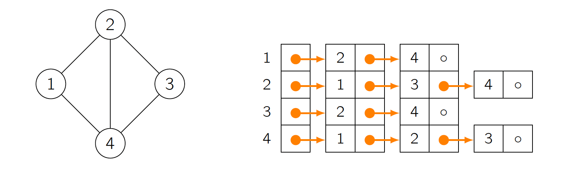

# Bachelor Project

# Backend

The debugger is implemented as a Plugin of Scraperflow and consists of two main Files: DebuggerHookAddon and DebuggerNodeHook. 

> Because NodeHook and Hook each extend Comparable. And a class cannot have more than one implementation of Comparable.
> 

## I. Data Structure

During the processing, the whole Process execution will be saved as a Graph (adjacent List): `Graph`.  That means each Node (`NodeItem`) knows his children (have a list of the IDs of his children) and each Node has a State (`NodeState`). We can have, for example:



## II. DebuggerHookAddon

It implements Hook and Addon

```java
public class DebuggerHookAddon implements Hook, Addon
```

### A**. Hook**

It is executed after workflow specifications are parsed and before workflows are executed. It has access to program arguments, class dependencies, workflow specification, and (parsed) workflow instances.

There are two of his methods that are override:

```java
@Override
public int order() {
    return Integer.MIN_VALUE;
}
```

All the Hooks are executed depending on her order from smallest to biggest. With it, we gave the debugger the smallest order and thus guarantee that it will be executed first at the start of the procedure. It is possible because Hook implements Comparable. That means all the Hooks are ordered and then executed. Depending on the arguments passed by the user, it can stop the execution and wait for a signal from the user (frontend).

```java
@Override
public void execute(...){
	startLogRedirection(debugger);
	...
}
```

It executes the hook and provides arguments, dependencies, and a ScrapeSpecification to ScrapeInstance map. It is also used to:

- redirect all the logs output to the frontend using the WebSocket
- collect all the specifications of the ScraperInstances
- and generate the Graph (that will be later sent to the frontend)

### B. Addon

It is executed before any workflow specification is loaded. Has access to program arguments and class dependencies.

It overrides load:

```java
@Override
void load(@NotNull DIContainer loadedDependencies, @NotNull String[] args)
```

It loads and initializes the addon with already loaded dependencies and executes its content only if the user gives the parameter debug as input’s argument. All the arguments are got, and it starts a new socket connection (DebuggerWebsocketServer)

## III. DebuggerNodeHook

It implements NodeHook.

### A.NodeHook

There are two of its methods that are override:

```java
void beforeProcess(@NotNull NodeContainer<? extends Node> n, @NotNull FlowMap o)
```

It will be executed before the processing of the Node. For the current Node, a new instance of `NodeItem` and `NodeState` will be created and if a “before breakpoint” has been set at this Node, its state will go in a “sleep mode” and the process will be blocked.

```java
void afterProcess(@NotNull NodeContainer<? extends Node> n, @NotNull FlowMap o)
```

It will be executed after the processing of the Node. If an “after breakpoint” has been set at this Node, the process will block at this Node. Here we also checked if the execution of the Node was successful. If not, the whole process will be completely stopped.

> During `beforeProcess` and `afterProcess` the current state of the context (variable's values) is saved in the `NodeItem`. They will be sent later to the front end for the flow inspection.
> 

# WebSocket: communication with frontend

Communication between the server and the client are done through a WebSocket connection and is handled by the class `DebuggerWebsocketServer`. A new instance of `DebuggerWebsocketServer` is created during the execution of the `load(...)` function in `DebuggerHookAddon`. 

As explained above, the user has the possibility to start Scraperflow with several arguments. Among these can be found the IP and port to be used to establish a tunnel connection. Per default, the port is set to 8890, and the default IP address to ‘0.0.0.0’, but these two parameters can be changed.

## Back-end

### 1. Reception

All the messages received by the server are handled by the method `onMessage(WebSocket conn, String message)` and have the following structure in JSON:

```json
{
  command: "name",
  data: {},
}
```

They are then cast in a `Request` Object. The command represents the name of a method in `DebuggerHookAddon`, which will be invoked and take data as a parameter.

### 2. Send

To send a message to the client, the server first checks if the client is connected, then we use the method `send()`. Because the message to be sent to the client has to be a string, the function `wrap` is used to transform the object to be sent into a string. For example, we could have: (in the right, it is the representation of the wrapped message in JSON)

```java
debugger.get().ifPresent(
	client -> {
    client.send(wrap("graphs", Map.of(
            "list",graphList,
            "nodesMap",nodesMap
	)));
});
```

```json
{
  type: "graphs",
  data: {
		"list": [...],
		"nodesMap": [...]
	},
}
```

In this example, graphs represent a key, which will be used in the Frontend to know which action to do with the received data.

## Front-end

### 1. Reception

In the front-end, we use an `EventListener` to detect messages sent by the server (back-end). When a new message arrives, it is processed by the `handleMassage` method. 

```jsx
this.socket.addEventListener("message", (e) => {
  this.handleMessage(e);
})
```

The received data is first transformed into a JSON. Then, thanks to the "type" key, the client will execute a specific task.

```java
handleMessage(event) {
let json = JSON.parse(event.data);
```

### 2. Send

To send a message to the server, the client first converts the "JSON" object, consisting of the keys command and data (As explained above), into a string before sending it to the server.

```java
params = JSON.stringify(params);
this.socket.send(params);
```

# API

## Signals that the server can receive (can be sent by the client)

| Function | Description | Parameters | Example |
| --- | --- | --- | --- |
| requestSpecifications | give specifications about the current instances | {} | {
  command:"requestSpecifications",
  data: {},
} |
| setReady | switch the whole debugger to a 'Ready' State | {flowId: String} | {
  command:"setReady",
  data: { flowId: “h3hhh4” },
} |
| stepwiseExecution | Execute the next Node in the process. And block after it. | {flowId: String} | {
  command:"stepwiseExecution",
  data: { flowId: “h3hhh4.”},
} |
| setContinue | Continue the execution | {flowId: String} | {
  command:"setContinue",
  data: { flowId: “h3hhh4.”},
} |
| wakeUpAll | Wake-up all the stopped/blocker flows | {flowId: String} | {
  command:"wakeUpAll",
  data: { flowId: “h3hhh4.”},
} |
| setBreakpoints | set the Breakpoints defined by the user | {breakpoints: Map} | {
  command:"setBreakpoints",
  data: { 
		breakpoints: {
			”start.o”: {after: true, before: true}
		}
	}
} |
| getGraphs | Return all the Graphs that represent the Whole flow's tree | {} | {
  command:"getGraphs",
  data: {},
} |
| getState | Get the current state of the debugger (Logs, information about Nodes and flows) | {} | {
  command:"getState",
  data: {},
} |
| stopProcess | Stop the whole process | {} | {
  command:"stopProcess",
  data: {},
} |

## Signals sent by the server

| Function | Description | Example |
| --- | --- | --- |
| nodePre | Give the current state and information about a node before its processing. | {
  type: "nodePre",
  data: {
		"node": {...},
		"flowMap": {...}
	},
} |
| nodePost | Give the current state and information about a node before its processing. | {
  type: "nodePre",
  data: {
		"node": {...},
		"flowMap": {...}
	},
} |
| readyState | Give the information if the debugger is in a ready state. | {
  type: "readyState",
  data: {...},
} |
| graphs | Give the Graph representation of the whole Scraperflow script. | {
  type: "graphs",
  data: {
		"list": {...},
		"nodeMap": {...}
	},
} |
| stoppedState | Say to the frontend that the debugger has been completely stopped. | {
  type: "stoppedState",
  data: {
		"stopped": false
	},
} |
| currentFlow | Give the ID of the currently processed flow. | {
  type: "currentFlow",
  data: {
		"flowId": “djsjs4343dsd”
	},
} |