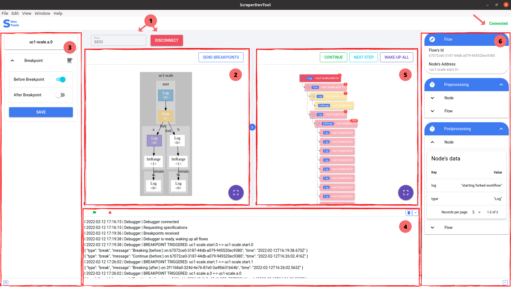

# User Documentation

## A. Description

This document presents the function interactive debugger for concurrent workflows of a scraperflow program. It provides a graph, which shows the relation between the different nodes of the program, it provides the processing flow of the program, gives the status of the variables, and also has a console, which gives information about the status of the connection and the processing of the program.

## B. Installation and Setup

ScraperflowDevTool can be run directly with the provided compiled versions: [Scraperflow.app](http://Scraperflow.app) on macOS, Windows, and Ubuntu. Or The User can follow these steps to build the app if the provided version is not supported by his system. 

### Necessary Technologies and Libraries

NodeJS (Yarn), Quasar, VueJS, Panzoom. To get started, follow these steps:

- Install NodeJS [link](https://nodejs.org/en/download/)
- Install Yarn in the ScraperDevTool folder (e.g.: debugger-a/frontend/ScraperDevTool)

```powershell
npm install --global yarn
```

- Install Quasar (e.g.: debugger-a/frontend/ScraperDevTool)

```powershell
npm install -g @quasar/cli
```

If Scraperflow (the backend) is run on the computer for the first time, it is necessary to build the project. Run this command in your terminal:

```powershell
./gradlew installDist
```

## C. User Manual

Once the app is successfully run, you should have the following interface displayed (fig: UI Interface), which is divided into 6 main parts: the header,  the left drawer, the left zone, the right zone, the right drawer, and the bottom zone.



UI Interface

### 1️⃣ Header

Gives the possibility to set the connection port with the server by editing the text field, and verifying the status of the connection with the server in the upper right corner where the label varies between connected and disconnected. In addition, the connection is established or interrupted when the user clicks on the Connect / Disconnect button.

### 2️⃣ Left zone

Here, the generated graph of the Node execution order is displayed.

### 3️⃣ Left drawer

Enables to have in the upper part of the left drawer the title of the currently selected node on the graph that has been displayed. Thus, the user can define in the left zone on this node if it should be a before breakpoint, an after a breakpoint, or both. In this case, the color of the node will respectively change to blue, yellow, and purple depending on the state of the breakpoint. When the breakpoints are defined, save and send them to the server by clicking on the **`SendBreakpoints`** button in the right corner of the left zone.

### 4️⃣ Bottom zone

After breakpoints have been set and saved, send ready to continue the execution or stop to abort the execution. The status of the execution is printed in the console that can also be cleared, or hidden. In the lower part, the buttons allow showing the console, to open and close the left and right drawer (fig: Console Log).

.png)

Console logs

### 5️⃣Right zone

Here, the execution workflow is displayed according to the flow order. Each flow finished flow is represented with the pink color. When a flow is stopped (in sleeping mode) it is colored yellow, processing flows are colored green. On the notification of each flow, there is the number of directed children flows.

If the user wants to execute with the step-wise execution, by selecting a flow he can use the  **`Continue`** button to finish the execution of the currently selected flow, use the button **`NextStep`,**  to execute the next flow or use **`WakeUp All`** to reactivate the execution of all the other sleeping Flows.

### 6️⃣ Right drawer

Displays all information about a selected flow such as flow name, flow-id, the corresponding node address, variable values, before, during, and after the processing.

## D. Execute a use case

- Step 1

Open Scraperflow in an IDE and run in the terminal the following command to build the backend:

```powershell
./install.sh
```

- Step 2

If you use the provided built version, just launch the electron app.  If you have to run from the terminal by yourself, then follow the steps:

In your scraperflowDevTool folder, execute the following command in your terminal to preview in a browser →

```powershell
yarn run dev
```

or, to preview as an electron app run  →

```powershell
yarn run dev:electron
```

- Step 3

Run in the terminal of the folder of  the use cases you want to execute, the following command:

```powershell
sudo ~/opt/lib/scraperflow/scraperflow usecase-folder-name/usecase-name.yml
```

For a stepwise execution, use the following command to prevent the construction of the flow graph, so breakpoints can be defined on the Nodes, and so allow the step-wise execution.

```powershell
sudo ~/opt/lib/scraperflow/scraperflow usecase-folder-name/usecase-name.yml stop-at-start
```

### E. How to?

- How to define a breakpoint

Once the app is launched, and the graph is displayed, open the left drawer, select the node in the left zone, activate either before breakpoint, after breakpoint, or both in the left drawer, and save. Click on ready for the execution to continue. 

- How to do stepwise execution

The stepwise execution may be possible either directly with the parameter `stop-at-start` or when a process execution is stopped due to a breakpoint. In The first case, the execution will not display the flow graph until you `**SendReady**` to the Server. In the second case, the stopped-flow is colored yellow and starting from on it, the following flows can be executed one after another.